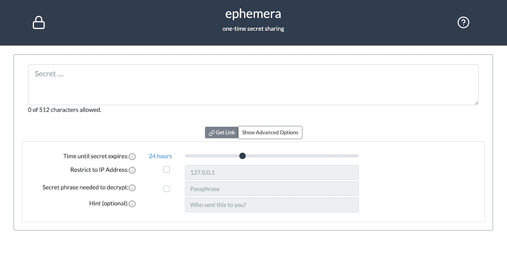

# Ephemera

This is an application for sharing a secret, the secret can only be accessed once, and then it is gone forever.

[Check it out](https://ephemera.link/#/)

## Basic Usage:
Type in the secret you want to share, and click "Get Link", provide this to the recipient and they can retrieve it.

In the advanced settings you can control more of the behavior:

 - How long the secret is valid, the default is 24 hours.
 - Restrict access to the secret for a specific internet address.
 - Add an additional layer of password protection that is neither stored in the database or as part of the link.

## Is this safe?

This application was designed to offer a moderate level of security, better than pasting a password in a chat window. But, there is no provable way to know what is being done behind the scenes, and the only way to be entirely sure is to get the source from Github, audit the code, and deploy it under your own control.

It runs as a serverless app in the AWS cloud, with the goal to be low cost, and maintenance free. Uses KMS to encrypt the secrets in the database, which costs ~$1/month, specifically so that it could be easily deployed within an organization for exclusive use with minimal cost impact.

## How does it work?

- When clicking on "Get Link", the browser uses javascript to create an encryption key, and encrypts the secret using AES-128 GCM with this key. Short secrets have additional plaintext added to further obfuscate the length of the message.
- The key is included as part of the URL that is displayed in the browser, but is *not* sent to the servers, a random IV, and the authentication tag are stored in the database.
- The storage is handled by an AWS Lambda function that: Uses KMS to encrypt the secret with AES-256 a second time, sets a timeout value for the secret to be deleted, and stores it in DynamoDB. This means by default the secret is encrypted twice, only Amazon has one key, and whoever has the link gets the second.
- When the recipient visits the site to retrieve the secret, the browser extracts the random ID for the stored secret and sends that to the Lambda function, which performs the first layer of decryption--immediately deleting the database record, and sends the result to the browser.
- The recipient's browser then decrypts the ciphertext sent back from the lambda function.
- If an optional passphrase was used, another key is created using a pbkdf2 algorithm, and will require the recipient to supply it for a third round of AES-128 GCM decryption. This could be something simple that is conveyed out of band to add a small additional layer of protection.

## Why Bother?

 - I appreciate that there are other similar services, such as viacry.pt and have used them, but ... if you want to ensure exclusive access for your organization for example, these rely on running a server full-time for the storage and back-end service. By using server-less technology in the cloud, anyone can deploy ephemera without committing to the cost of running, and maintaining a VPS.
 - Most of the existing solutions immediately display the link when visited, this creates problems with tools that prefetch an image of a website (like a chat program.)
 - Being able to limit by IP is crucial when users are on a known network.
 - I wanted to be sure the tool I was using used a stronger cipher, with random IV, and message authentication.
 - The ability to have an additional layer of encryption is nice. Not shared via a link, and unknown to the backend ... adds a distinct and important layer of security

# Building

Most recently built using Go 1.14 and Node 14.7.0

- Building the Go components is done via the Makefile, by default it will try to push the new binaries directly into lambda.
- For the client, run `npm install` and `npm build` and put the generated files from `client/dist/` somewhere to be served.
	- copy the `example.env` file to `.env` and change the API endpoint to where the lambda functions are available.

## Infrastructure

Sadly this part is incomplete, the provided ansible handles building the dynamo tables and creating the lambda functions.
It does not take care of API gateway, S3, or Cloudfront. Pull requests happily accepted, would prefer terraform, over ansible
given the nature of what's going on here. Note also that CORS headers need to be setup for the app to work.

*It's been a long time since I ran the ansible playbook, so it's possible that it's not compatible with the latest version.*

Move the `./ansible/group_vars/example-all.yml` to `./ansible/group_vars/all.yml` and edit to suit
